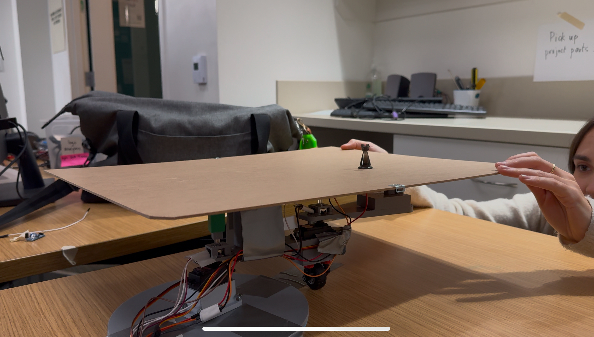

## Wizard's Chess
Unfortunately, there will never be enough atoms in the universe to solve a game of chess.

## Team members
* Jared Weissberg
* Zara Rutherford

## Project description
This is a naive implementation of a chess algorithm, using a minimax scoring function with alpha/beta pruning. A 2-joint robotic arm moves these pieces using an electromagnet, servo motors, and rotary encoders (position). Please see headers.txt for all functions. Use this to understand overview.txt (in place of detailed file headers), which describes how our program functions. We implement minimax with alpha-beta pruning and an initial heuristic.

Final style submissions are titled [jared-final-style.txt](jared-final-style.txt) and [zara-final-style.txt](zara-final-style.txt).

Key files:
* [main.c](main.c)
* [hardware/myprogram.c](hardware/myprogram.c) 
* [overview.txt](overview.txt)
* [example_game.txt](example_game.txt)
* [headers.txt](headers.txt)
* [demo.jpeg](demo.jpeg)
* [demo.MOV](demo.MOV)

## Member contribution
Jared focused on the chess algorithm. Zara constructed the 2-joint robotic arm and wrote the hardware main program and all header c and h files. Jared and Zara integrated the hardware main program into the chess engine (i.e., rewriting myprogram.c to create a mapping from board positional values to move from initial to source, move to destination, and return to initial position).

## References
These two ideas inspired our project, although we adapted no code from either:
* https://github.com/ellenjxu/mango-chess
* https://www.chess.com/forum/view/chess-equipment/making-my-automatic-chessboard
The main algorithm was designed from scratch. There are examples on sites like Wikipedia of algorithms implemented (e.g., minimax, alpha/beta pruning).

These sites were referenced for the 2-joint arm:
* 
* 

## Self-evaluation
We did everything we proposed except for Mango-Pi interaction (we excluded it in favor of simplicity on one device). One thing worth mentioning is instead of networking through the Mango-Pi, we wrote a simple Python script to host the UART output, although this was just extra. It is almost identical to the terminal interface, so we demoed the terminal.

The chess algorithm works well enough to face an intermediate player. It incorporates edge cases like castling, en passant, draw by threefold repetition, etc. Areas of improvement include more efficiently generating and cycling through potential moves, dynamic scoring that incorporates---through board state rather than move count---more types of game play beyond beginning, middle, and end game. Furthermore, alpha-beta pruning and the initial heuristic could be more robust.

Ultimately, the goal is to make this algorithm as efficient as possible in the future to allow for more recursive calls of minimax (i.e., more depth). Dynamic recursive calling based on game state would be cool (e.g., 2 levels of depth in beginning versus 4-8 middle game)! We could have used Monte Carlo search trees instead of alpha-beta pruning or neural nets like AlphaZero.

We are proud of the breadth of edge cases we was able to include and the heuristic before the recursive minimax calls. Furthermore, this was a great effort in efficient algorithm design (putting 161 into practice). It took well over 100 hours to complete the chess engine without piece movement (~15,000 lines of code initially written and refactored/refined into ~4-5,000, not to mention Python + text). We hope you appreciate the effort. My guess is this might take an average SWE 400-600 hours. It took Stockfish ~40,000-100,000 LOC and 2 years to develop + 15 to refine.

One of the things that doesn't make it events like demoes is the Wednesday trip to the LEGO store to buy small car kits for wheels to move the 2-joint arm :)

How well was your team able to execute on the plan in your proposal?  
Any trying or heroic moments you would like to share? Of what are you particularly proud:
the effort you put into it? the end product? the process you followed?
what you learned along the way? Tell us about it!

## Photos

See the [demo video](https://youtu.be/SC8W8NMmxuk) on YouTube, [demo.MOV](demo.MOV), and [demo.jpeg](demo.jpeg) for an example of the arm. See [example_game.txt](example_game.txt) for a sample game and commentary.

## Program Logic
This is the core logic for the chess engine. It is taken verbatim from overview.txt.

- main in ./main.c
  - find_best_move (AI's turn)
    - For AI's pieces:
      - generate_moves (calls piece-specific generators)
        - generate_pawn_moves
        - generate_knight_moves
        - generate_bishop_moves
        - generate_rook_moves
        - generate_queen_moves
        - generate_king_moves
    - For each generated move:
      - move_sort (assigns a preliminary score)
        - evaluate_castling (if applicable)
        - evaluate_captures (if applicable)
      - make_move (simulate move on a copy)
      - minimax (evaluate move recursively)
        - If depth == 0 or game over:
          - evaluate_board
            - Initialize total_score
            - Loop through board squares:
              - For each piece:
                - evaluate_position
                  - Switch based on piece type:
                    - evaluate_pawn
                    - evaluate_knight
                    - evaluate_bishop
                    - evaluate_rook
                    - evaluate_queen
                    - evaluate_king
                - Return position_value
              - Update total_score
            - Continue looping through board
            - Apply additional evaluations:
              - evaluate_king_safety
              - Other strategic considerations
            - Return total_score
        - If depth > 0:
          - For opponent's pieces:
            - generate_moves (calls piece-specific generators)
          - For each opponent's move:
            - move_sort (assigns a preliminary score)
            - make_move (simulate opponent's move)
            - minimax (recursive call)
          - Alpha-beta pruning
    - Select move with best score
  - make_move (execute AI's move)
    - Update board state
    - Handle special moves (castling, en passant, promotion)
    - Update game state variables (move_count, move_history)
    - Check for draw conditions (e.g., fifty-move rule, repetition)
  - Proceed to player's turn

Below is the main function called in hardware/myprogram.c for the 2-joint robotic arm:

Example move: Move piece from (1,1) to (3,3)

move_piece(1, 1, 3, 3, &servo_centre, &servo_outer, centre_encoder, outer_encoder);

This will:
1. Move from init to (1,1) by calling calculating_angles from IK.c (inverse kinematics)
2. Pick piece (activates electromagnet)
3. Move to (3,3)
4. Drop piece
5. Return back to initial position by reversing the ticks